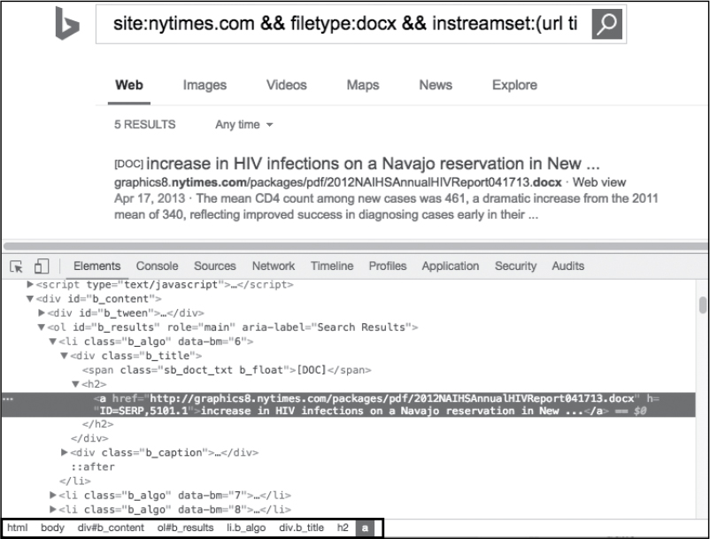

## Parsing Document Metadata With Bing Scraping

As we stressed in the Shodan section, relatively benign information—when viewed in the correct context—can prove to be 
critical, increasing the likelihood that your attack against an organization succeeds. Information such as employee 
names, phone numbers, email addresses, and client software versions are often the most highly regarded because they 
provide concrete or actionable information that attackers can directly exploit or use to craft attacks that are more 
effective and highly targeted. One such source of information, popularized by a tool named [FOCA, is document metadata.](https://github.com/ElevenPaths/FOCA)

Applications store arbitrary information within the structure of a file saved to disk. In some cases, this can include 
geographical coordinates, application versions, operating system information, and usernames. Better yet, search 
engines contain advanced query filters that allow you to retrieve specific files for an organization. The remainder 
of this chapter focuses on building a tool that scrapes—or as my lawyer calls it, indexes—Bing search results to 
retrieve a target organization’s Microsoft Office documents, subsequently extracting relevant metadata.

### _Setting Up Your Environment And Planning_
Before diving into the specifics, we’ll start by stating the objectives. First, you’ll focus solely on `Office Open XML 
documents—those ending in xlsx, docx, pptx, and so on`. Although you could certainly include legacy Office data types, 
the binary formats make them exponentially more complicated, increasing code complexity and reducing readability. 
The same can be said for working with PDF files. Also, the code you develop won’t handle Bing pagination, instead 
only parsing initial page search results. We encourage you to build this into your working example and explore file 
types beyond Open XML.

`Why not just use the Bing Search APIs for building this, rather than doing HTML scraping?` Because you already know 
how to build clients that interact with structured APIs. There are practical use cases for scraping HTML pages, 
particularly when no API exists. Rather than rehashing what you already know, we’ll take this as an opportunity to 
introduce a new method of extracting data. You’ll use an excellent package, `goquery`, which mimics the functionality 
of jQuery, a JavaScript library that includes an intuitive syntax to traverse HTML documents and select data within. Start by installing `goquery`:
```shell script
$ go get github.com/PuerkitoBio/goquery
```
We have used `mod` as dependency manager, so check the [go.mod file](go.mod) for installed dependencies. 
Fortunately, that’s the only prerequisite software needed to complete the development. You’ll use standard Go 
packages to interact with Open XML files. These files, despite their file type suffix, are ZIP archives that, when 
extracted, contain XML files. The metadata is stored in two files within the docProps directory of the archive:
```shell script
$ unzip test.xlsx
$ tree
--snip--
|---docProps
|   |---app.xml
|   |---core.xml
--snip—
```

The `core.xml` file contains the author information as well as modification details. It’s structured as follows:
```xml
<?xml version="1.0" encoding="UTF-8" standalone="yes"?>
<cp:coreProperties xmlns:cp="http://schemas.openxmlformats.org/package/2006/metadata
/core-properties"
                   xmlns:dc="http://purl.org/dc/elements/1.1/"
                   xmlns:dcterms="http://purl.org/dc/terms/"
                   xmlns:dcmitype="http://purl.org/dc/dcmitype/"
                   xmlns:xsi="http://www.w3.org/2001/XMLSchema-instance">
    <dc:creator>Dan Kottmann</dc:creator>❶
    <cp:lastModifiedBy>Dan Kottmann</cp:lastModifiedBy>❷
    <dcterms:created xsi:type="dcterms:W3CDTF">2016-12-06T18:24:42Z</dcterms:created>
    <dcterms:modified xsi:type="dcterms:W3CDTF">2016-12-06T18:25:32Z</dcterms:modified>
</cp:coreProperties>
```
The creator ❶ and lastModifiedBy ❷ elements are of primary interest. These fields contain employee or usernames that you 
can use in a social-engineering or password-guessing campaign. 

The `app.xml` file contains details about the application type and version used to create the Open XML document. 
Here’s its structure:
```xml
<?xml version="1.0" encoding="UTF-8" standalone="yes"?>
<Properties xmlns="http://schemas.openxmlformats.org/officeDocument/2006/extended-properties"
            xmlns:vt="http://schemas.openxmlformats.org/officeDocument/2006/docPropsVTypes">
    <Application>Microsoft Excel</Application>❶
    <DocSecurity>0</DocSecurity>
    <ScaleCrop>false</ScaleCrop>
    <HeadingPairs>
        <vt:vector size="2" baseType="variant">
            <vt:variant>
                <vt:lpstr>Worksheets</vt:lpstr>
            </vt:variant>
            <vt:variant>
                <vt:i4>1</vt:i4>
            </vt:variant>
        </vt:vector>
    </HeadingPairs>
    <TitlesOfParts>
        <vt:vector size="1" baseType="lpstr">
            <vt:lpstr>Sheet1</vt:lpstr>
        </vt:vector>
    </TitlesOfParts>
    <Company>ACME</Company>❷
    <LinksUpToDate>false</LinksUpToDate>
    <SharedDoc>false</SharedDoc>
    <HyperlinksChanged>false</HyperlinksChanged>
    <AppVersion>15.0300</AppVersion>❸
</Properties>
```
You’re primarily interested in just a few of those elements: Application ❶, Company ❷, and AppVersion ❸. The version 
itself doesn’t obviously correlate to the Office version name, such as Office 2013, Office 2016, and so on, but a 
logical mapping does exist between that field and the more readable, commonly known alternative. The code you develop 
will maintain this mapping.

### _Defining the metadata Package_
In [metadata/openxml.go](metadata/openxml.go), define the Go types that correspond to these XML datasets in a new 
package named `metadata` and put the code in a file named `openxml.go`—one type for each XML file you wish to parse. 
Then add a data mapping and convenience function for determining the recognizable Office version that corresponds to 
the `AppVersion`.
```go
type OfficeCoreProperty struct {
    XMLName        xml.Name `xml:"coreProperties"`
    Creator        string   `xml:"creator"`
    LastModifiedBy string   `xml:"lastModifiedBy"`
}

type OfficeAppProperty struct {
    XMLName     xml.Name `xml:"Properties"`
    Application string   `xml:"Application"`
    Company     string   `xml:"Company"`
    Version     string   `xml:"AppVersion"`
}

var OfficeVersions❶ = map[string]string{
    "16": "2016",
    "15": "2013",
    "14": "2010",
    "12": "2007",
    "11": "2003",
}

func (a *OfficeAppProperty) GetMajorVersion()❷ string {
    tokens := strings.Split(a.Version, ".")❸

    if len(tokens) < 2 {
        return "Unknown"
    }
    v, ok := OfficeVersions❹ [tokens[0]]
    if !ok {
        return "Unknown"
    }
    return v
}
```

After you define the `OfficeCoreProperty` and `OfficeAppProperty` types, define a map, `OfficeVersions`, that 
maintains a relationship of major version numbers to recognizable release years ❶. To use this map, define a method, 
`GetMajorVersion()`, on the `OfficeAppProperty` type ❷. The method splits the XML data’s `AppVersion` value to 
retrieve the major version number ❸, subsequently using that value and the `OfficeVersions` map to retrieve the 
release year ❹.

### _Mapping the Data to Structs_
Now that you’ve built the logic and types to work with and inspect the XML data of interest, you can create the code 
that reads the appropriate files and assigns the contents to your structs. To do this, define `NewProperties()` and 
`process()` functions in [openxml.go](metadata/openxml.go):
```go
func NewProperties(r *zip.Reader) (*OfficeCoreProperty, *OfficeAppProperty, error) {❶
    var coreProps OfficeCoreProperty
    var appProps OfficeAppProperty

    for _, f := range r.File {❷
        switch f.Name {❸
        case "docProps/core.xml":
            if err := process(f, &coreProps)❹; err != nil {
                return nil, nil, err
            }
        case "docProps/app.xml":
            if err := process(f, &appProps)❺; err != nil {
                return nil, nil, err
            }
        default:
            continue
        }
    }
    return &coreProps, &appProps, nil
}

func process(f *zip.File, prop interface{}) error {❻
    rc, err := f.Open()
    if err != nil {
        return err
    }
    defer rc.Close()

    if err := ❼xml.NewDecoder(rc).Decode(&prop); err != nil {
        return err
    }
    return nil
}
```

The `NewProperties()` function accepts a `*zip.Reader`, which represents an `io.Reader` for ZIP archives ❶. Using 
the `zip.Reader` instance, iterate through all the files in the archive ❷, checking the filenames ❸. If a filename 
matches one of the two property filenames, call the `process()` function ❹❺, passing in the file and the arbitrary 
structure type you wish to populate—either `OfficeCoreProperty` or `OfficeAppProperty`.

The `process()` function accepts two parameters: a `*zip.File` and an `interface{}` ❻. Similar to the [Metasploit 
tool you developed](../metasploit), this code accepts a generic `interface{}` type to allow for the file contents 
to be assigned into any data type. This increases code reuse because there’s nothing type-specific within the 
`process()` function. Within the function, the code reads the contents of the file and unmarshals the XML data into 
the struct ❼.

### _Searching and Receiving Files with Bing_
You now have all the code necessary to open, read, parse, and extract Office Open XML documents, and you know what you 
need to do with the file. Now, you need to figure out how to search for and retrieve files by using Bing. Here’s the 
plan of action you should follow:
  - Submit a search request to Bing with proper filters to retrieve targeted results.
  - Scrape the HTML response, extracting the HREF (link) data to obtain direct URLs for documents.
  - Submit an HTTP request for each direct document URL
  - Parse the response body to create a zip.Reader
  - Pass the zip.Reader into the code you already developed to extract metadata.

The following sections discuss each of these steps in order.

The first order of business is to build a search query template. Much like Google, Bing contains advanced query 
parameters that you can use to filter search results on numerous variables. Most of these filters are submitted in a 
`filter_type: value` format. Without explaining all the available filter types, let’s instead focus on what helps you 
achieve your goal. The following list contains the three filters you’ll need. Note that you could use additional filters, 
but at the time of this writing, they behave somewhat unpredictably.
  - **site**: Used to filter the results to a specific domain.
  - **filetype**: Used to filter the results based off resource file type
  - **instreamset**: Used to filter the results to include only certain file extensions

An example query to retrieve docx files from nytimes.com would look like this:
```shell script
site:nytimes.com && filetype:docx && instreamset:(url title):docx
```

After submitting that query, take a peek at the resulting URL in your browser. It should resemble above picture. Additional 
parameters may appear after this, but they’re inconsequential for this example, so you can ignore them.

Now that you know the URL and parameter format, you can see the HTML response, but first you need to determine where in 
the Document Object Model (DOM) the document links reside. You can do this by viewing the source code directly, or 
limit the guesswork and just use your browser’s developer tools. The following image shows the full HTML element 
path to the desired HREF. You can use the element inspector, as in below picture, to quickly select the link to 
reveal its full path.



With that path information, you can use goquery to systematically pull all data elements that match an HTML path. 
Enough talk! above snippt puts it all together: retrieving, scraping, parsing, and extracting. Save this code to 
[main.go](client/main.go).
```go
❶ func handler(i int, s *goquery.Selection) {
       url, ok := s.Find("a").Attr("href")❷
       if !ok {
           return
       }

       fmt.Printf("%d: %s\n", i, url)
       res, err := http.Get(url)❸
       if err != nil {
           return
       }
       buf, err := ioutil.ReadAll(res.Body)❹
       if err != nil {
           return
       }
       defer res.Body.Close()

       r, err := zip.NewReader(bytes.NewReader(buf)❺, int64(len(buf)))
       if err != nil {
           return
       }

       cp, ap, err := metadata.NewProperties(r)❻
       if err != nil {
           return
       }

       log.Printf(
           "%25s %25s - %s %s\n",
           cp.Creator,
           cp.LastModifiedBy,
           ap.Application,
           ap.GetMajorVersion())
   }

   func main() {
       if len(os.Args) != 3 {
           log.Fatalln("Missing required argument. Usage: main.go domain ext")
       }
       domain := os.Args[1]
       filetype := os.Args[2]

    ❼ q := fmt.Sprintf(
           "site:%s && filetype:%s && instreamset:(url title):%s",
           domain,
           filetype,
           filetype)
    ❽ search := fmt.Sprintf("http://www.bing.com/search?q=%s", url.QueryEscape(q))
       doc, err := goquery.NewDocument(search)❾
       if err != nil {
           log.Panicln(err)
       }

       s := "html body div#b_content ol#b_results li.b_algo div.b_title h2"
    ❿ doc.Find(s).Each(handler)
  }
```

You create two functions. The first, `handler()`, accepts a `goquery.Selection` instance ❶ (in this case, it will be 
populated with an anchor HTML element) and finds and extracts the href attribute ❷. This attribute contains a direct 
link to the document returned from the Bing search. Using that URL, the code then issues a GET request to 
retrieve the document ❸. Assuming no errors occur, you then read the response body ❹, leveraging it to create a 
`zip.Reader` ❺. Recall that the function you created earlier in your metadata package, `NewProperties()`, expects a 
zip.Reader. Now that you have the appropriate data type, pass it to that function ❻, and properties are populated 
from the file and printed to your screen.

The `main()` function bootstraps and controls the whole process; you pass it the domain and file type as command 
line arguments. The function then uses this input data to build the Bing query with the appropriate filters ❼. The 
filter string is encoded and used to build the full Bing search URL ❽. The search request is sent using the 
`goquery.NewDocument()` function, which implicitly makes an HTTP GET request and returns a goquery-friendly 
representation of the HTML response document ❾. This document can be inspected with goquery. Finally, use the 
HTML element selector string you identified with your browser developer tools to find and iterate over matching 
HTML elements ❿. For each matching element, a call is made to your handler() function.

A sample run of the code produces output similar to the following:
```shell script
$ go run main.go nytimes.com docx
0: http://graphics8.nytimes.com/packages/pdf/2012NAIHSAnnualHIVReport041713.docx
2020/12/21 11:53:50     Jonathan V. Iralu     Dan Frosch - Microsoft Macintosh Word 2010
1: http://www.nytimes.com/packages/pdf/business/Announcement.docx
2020/12/21 11:53:51     agouser               agouser - Microsoft Office Outlook 2007
2: http://www.nytimes.com/packages/pdf/business/DOCXIndictment.docx
2020/12/21 11:53:51     AGO                   Gonder, Nanci - Microsoft Office Word 2007
3: http://www.nytimes.com/packages/pdf/business/BrownIndictment.docx
2020/12/21 11:53:51     AGO                   Gonder, Nanci - Microsoft Office Word 2007
4: http://graphics8.nytimes.com/packages/pdf/health/Introduction.docx
2020/12/21 11:53:51     Oberg, Amanda M       Karen Barrow - Microsoft Macintosh Word 2010
```

You can now search for and extract document metadata for all Open XML files while targeting a specific domain. `I 
encourage you to expand on this example to include logic to navigate multipage Bing search results, to include other 
file types beyond Open XML, and to enhance the code to concurrently download the identified files.`