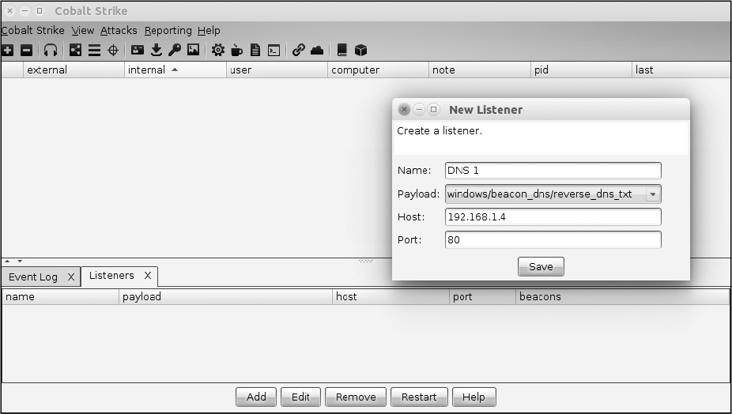
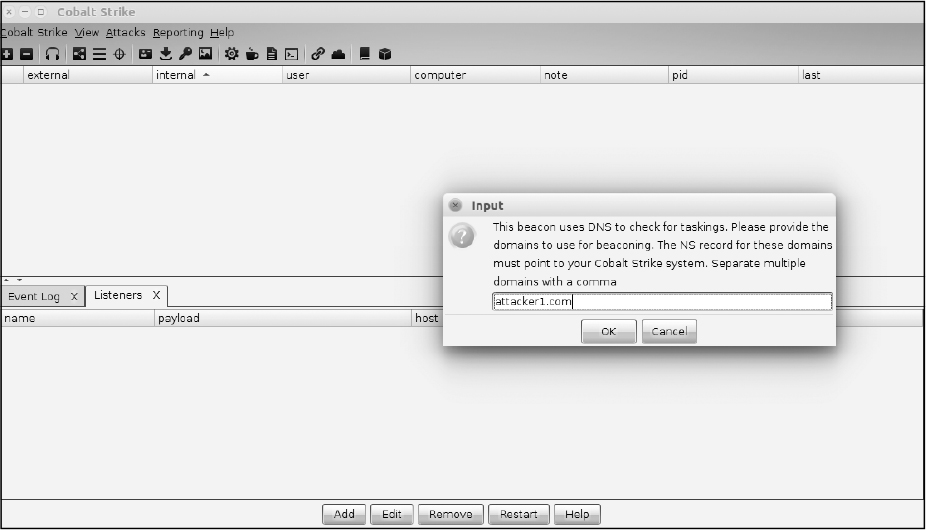

# Exploiting DNS

The `Domain Name System (DNS)` locates internet domain names and translates them to IP addresses. It can be an effective 
weapon in the hands of an attacker, because organizations commonly allow the protocol to egress restricted networks and 
they frequently fail to monitor its use adequately. It takes a little knowledge, but savvy attackers can leverage these 
issues throughout nearly every step of an attack chain, including reconnaissance, command and control (C2), and even 
data exfiltration. In this chapter, you’ll learn how to write your own utilities by using Go and third-party packages 
to perform some of these capabilities. You’ll start by resolving hostnames and IP addresses to reveal the many types 
of DNS records that can be enumerated. Then you’ll use patterns illustrated in earlier chapters to build a massively 
concurrent subdomain-guessing tool. Finally, you’ll learn how to write your own DNS server and proxy, and you’ll use 
DNS tunneling to establish a C2 channel out of a restrictive network!

### Writing DNS Clients
Before exploring programs that are more complex, let’s get acquainted with some of the options available for client 
operations. Go’s built-in `net` package offers great functionality and supports most, if not all, record types. The upside 
to the built-in package is its straightforward API. For example, `LookupAddr(addr string)` returns a list of hostnames for 
a given IP address. The downside of using Go’s built-in package is that you can’t specify the destination server; instead, 
the package will use the resolver configured on your operating system. Another downside is that you can’t run deep inspection 
of the results.

To get around this, you’ll use an amazing third-party package called the Go DNS package written by Miek Gieben. This is 
our preferred DNS package because it’s highly modular, well written, and well tested. Use the following to install this 
package:
```shell script
$ go get github.com/miekg/dns
```

Once the package is installed, you’re ready to follow along with the upcoming code examples. You’ll begin by performing 
A record lookups in order to resolve IP addresses for hostnames.

#### _Retrieving A Records_
Let’s start by performing a lookup for a `fully qualified domain name (FQDN)`, which specifies a host’s exact location in 
the DNS hierarchy. Then we’ll attempt to resolve that FQDN to an IP address, using a type of DNS record called an `A record`. 
We use A records to point a domain name to an IP address. [get_a/main.go](get_a/main.go) shows an example lookup.
```go
package main

import (
    "fmt"

    "github.com/miekg/dns"
)

func main() {
 ❶ var msg dns.Msg
 ❷ fqdn := dns.Fqdn("stacktitan.com")
 ❸ msg.SetQuestion(fqdn, dns.TypeA)
 ❹ dns.Exchange(&msg, "8.8.8.8:53")
}
```

Start by creating a new `Msg` ❶ and then call `fqdn(string)` to transform the domain into a FQDN that can be exchanged with 
a DNS server ❷. Next, modify the internal state of the Msg with a call to `SetQuestion(string, uint16)` by using the TypeA 
value to denote your intent to look up an A record ❸. (This is a const defined in the package. You can view the other 
supported values in the package documentation.) Finally, place a call to `Exchange(*Msg, string)` ❹ in order to send the 
message to the provided server address, which is a DNS server operated by Google in this case.

As you can probably tell, this code isn’t very useful. Although you’re sending a query to a DNS server and asking for the 
A record, you aren’t processing the answer; you aren’t doing anything meaningful with the result. Prior to programmatically 
doing that in Go, let’s first review what the DNS answer looks like so that we can gain a deeper understanding of the 
protocol and the different query types.

Before you execute the program in [get_a/main.go](get_a/main.go), run a packet analyzer, such as `Wireshark` or `tcpdump`, 
to view the traffic. Here’s an example of how you might use tcpdump on a Linux host for that particular case:
```shell script
$ sudo tcpdump -i eth0 -n udp port 53
```

In a separate terminal window, compile and execute your program like this:
```shell script
$ go run main.go
```

Once you execute your code, you should see a connection to 8.8.8.8 over UDP 53 in the output from your packet capture. You 
should also see details about the DNS protocol, as shown here:
```shell script
$ sudo tcpdump -i eth0 -n udp port 53
tcpdump: verbose output suppressed, use -v or -vv for full protocol decode
listening on ens33, link-type EN10MB (Ethernet), capture size 262144 bytes
23:55:16.523741 IP 192.168.7.51.53307 > 8.8.8.8.53:❶ 25147+ A?❷ stacktitan.com. (32)
23:55:16.650905 IP 8.8.8.8.53 > 192.168.7.51.53307: 25147 1/0/0 A 104.131.56.170 (48) ❸
```

The packet capture output produces a couple of lines that require further explanation. First, a query is being placed from 
192.168.7.51 to 8.8.8.8 by using UDP 53 ❶ while requesting a DNS A record ❷. The response ❸ is returned from Google’s 
8.8.8.8 DNS server, which contains the resolved IP address, 104.131.56.170.

Using a packet analyzer such as tcpdump, you’re able to resolve the domain name stacktitan.com to an IP address. Now 
let’s take a look at how to extract that information by using Go.

#### _Processing Answers from a Msg struct_
The returned values from `Exchange(*Msg, string)` are `(*Msg, error)`. Returning the error type makes sense and is common 
in Go idioms, but why does it return `*Msg` if that’s what you passed in? To clarify this, look at how the struct is 
defined in the source:
```go
type Msg struct {
    MsgHdr
    Compress    bool       `json:"-"` // If true, the message will be compressed...
 ❶ Question    []Question            // Holds the RR(s) of the question section.
 ❷ Answer      []RR                  // Holds the RR(s) of the answer section.
    Ns          []RR                  // Holds the RR(s) of the authority section.
    Extra       []RR                  // Holds the RR(s) of the additional section.
}
```
As you can see, the `Msg` struct holds both questions and answers. This lets you consolidate all your DNS questions and 
their answers into a single, unified structure.  The `Msg` type has various methods that make working with the data easier. 
For example, the `Question` slice ❶ is being modified with the convenience method `SetQuestion()`. You could modify this 
slice directly by using `append()` and achieve the same outcome. The `Answer` slice ❷ holds the response to the queries 
and is of type RR. [get_a/main.go](get_a/main.go) demonstrates how to process the answers.
```go
package main

import (
    "fmt"

    "github.com/miekg/dns"
)

func main() {
    var msg dns.Msg
    fqdn := dns.Fqdn("stacktitan.com")
    msg.SetQuestion(fqdn, dns.TypeA)
 ❶ in, err := dns.Exchange(&msg, "8.8.8.8:53")
    if err != nil {
        panic(err)
    }
 ❷ if len(in.Answer) < 1 {
        fmt.Println("No records")
        return
    }
    for _, answer := range in.Answer {
        if a❸, ok:= answer.(*dns.A)❹; ok {
         ❺ fmt.Println(a.A)
        }
    }
}
```

Our example begins by storing the values returned from `Exchange`, checking whether there was an error, and if so, calling 
`panic()` to stop the program ❶. The `panic()` function lets you quickly see the stack trace and identify where the error 
occurred. Next, validate that the length of the Answer slice is at least 1 ❷, and if it isn’t, indicate that there are no 
records and immediately return—after all, there will be legitimate instances when the domain name cannot be resolved.

The type `RR` is an interface with only two defined methods, and neither allows access to the IP address stored in the 
answer. To access those IP addresses, you’ll need to perform a type assertion to create an instance of the data as your 
desired type.

First, loop over all the answers. Next, perform the type assertion on the answer to ensure that you’re dealing with a 
`*dns.A` type ❸. When performing this action, you can receive two values: the data as the asserted type and a bool 
representing whether the assertion was successful ❹. After checking whether the assertion was successful, print the IP 
address stored in `a.A` ❺. Although the type is `net.IP`, it does implement a `String()` method, so you can easily print 
it.

Spend time with this code, modifying the DNS query and exchange to search for additional records. The type assertion may 
be unfamiliar, but it’s a similar concept to type casting in other languages.

#### _Enumerating Subdomains_
Now that you know how to use Go as a DNS client, you can create useful tools. In this section, you’ll create a subdomain-guessing 
utility. Guessing a target’s subdomains and other DNS records is a foundational step in `reconnaissance`, because the more 
subdomains you know, the more you can attempt to attack. You’ll supply our utility a candidate wordlist (a dictionary file) 
to use for guessing subdomains.

With DNS, you can send requests as fast as your operating system can handle the processing of packet data. While the language 
and runtime aren’t going to become a bottleneck, the destination server will. Controlling the concurrency of your program 
will be important here, just as it has been in previous chapters.

For the coding exercise with more detailed information, check the subfolder in current directory:
  - [Subdomain Guesser](subdomain_guesser/README.md)
  
### Writing DNS Servers
#### _Lab Setup and Server Introduction_
Your lab consists of two virtual machines (VMs): a Linux based VM to act as client and an Centos 7 VM to act as server. This 
example uses VMWare Workstation along with Bridged network mode for each machine; you can use a private virtual network, 
but make sure that both machines are on the same network. Your server will run two Cobalt Strike Docker instances built 
from the official Java Docker image (Java is a prerequisite for Cobalt Strike).

> **WHAT IS COBALT STRIKE?**  
> Please refer to https://www.cobaltstrike.com/

You can setup the lab environment by referring [this repo](https://github.com/bilalcaliskan/vagrantboxes). 

For Docker installation, please refer to [this link](https://docs.docker.com/engine/install/centos/).

With Docker installed, use the following command to download a Java image. This command pulls down the base Docker Java 
image but doesn’t create any containers. You’re doing this to prepare for your Cobalt Strike builds shortly.
```shell script
$ docker pull java
```

Finally, you need to ensure that dnsmasq isn’t running, because it listens on port 53. Otherwise, your own DNS servers 
won’t be able to operate, since they’re expected to use the same port. Kill the process by ID if it’s running:
```shell script
$ ps -ef | grep dnsmasq
nobody    3386  2020  0 12:08
$ sudo kill 3386
```

Ensure the go environment is setup on that ubuntu vm. [Refer here to install go](https://golang.org/doc/install).

In your GOPATH on the Ubuntu system, create a new directory called [a_server](a_server) and a file 
to hold your [a_server/main.go](a_server/main.go) code. Below snippet shows the entire code for creating a simple DNS 
server.
```go
package main

import (
    "log"
    "net"

    "github.com/miekg/dns"
)

func main() {
 ❶ dns.HandleFunc(".", func(w dns.ResponseWriter, req *dns.Msg) {
     ❷ var resp dns.Msg
        resp.SetReply(req)
        for _, q := range req.Question {
         ❸ a := dns.A{
                Hdr: dns.RR_Header{
                    Name:   q.Name,
                    Rrtype: dns.TypeA,
                    Class:  dns.ClassINET,
                    Ttl:    0,
                },
                A: net.ParseIP("127.0.0.1").To4(),
            }
        ❹ resp.Answer = append(resp.Answer, &a)
        }
     ❺ w.WriteMsg(&resp)
    })
 ❻ log.Fatal(dns.ListenAndServe(":53", "udp", nil))
}
```

The server code starts with a call to `HandleFunc()` ❶; it looks a lot like the `net/http` package. The function’s first 
argument is a query pattern to match. You’ll use this pattern to indicate to the DNS servers which requests will be 
handled by the supplied function. By using a period, you’re telling the server that the function you supply in the 
second argument will handle all requests.

The next argument passed to `HandleFunc()` is a function containing the logic for the handler. This function receives 
two arguments: a ResponseWriter and the request itself. Inside the handler, you start by creating a new message and 
setting the reply ❷. Next, you create an answer for each question, using an A record, which implements the RR interface. 
This portion will vary depending on the type of answer you’re looking for ❸. The pointer to the A record is appended to 
the response’s Answer field by using `append()` ❹. With the response complete, you can write this message to the calling 
client by using `w.WriteMsg()` ❺. Finally, to start the server, `ListenAndServe()` is called ❻. This code resolves all 
requests to an IP address of 127.0.0.1.

Once the server is compiled and started, you can test it by using dig. Confirm that the hostname for which you’re querying 
resolves to 127.0.0.1. That indicates it’s working as designed.
```shell script
$ dig @localhost facebook.com

; <<>> DiG 9.10.3-P4-Ubuntu <<>> @localhost facebook.com
; (1 server found)
;; global options: +cmd
;; Got answer:
;; ->>HEADER<<- opcode: QUERY, status: NOERROR, id: 33594
;; flags: qr rd; QUERY: 1, ANSWER: 1, AUTHORITY: 0, ADDITIONAL: 0
;; WARNING: recursion requested but not available

;; QUESTION SECTION:
;facebook.com.                   IN        A

;; ANSWER SECTION:
facebook.com.             0      IN        A      127.0.0.1

;; Query time: 0 msec
;; SERVER: 127.0.0.1#53(127.0.0.1)
;; WHEN: Sat Dec 19 13:13:45 MST 2020
;; MSG SIZE  rcvd: 58
```

Note that the server will need to be started with sudo or a root account, because it listens on a privileged port—port 53. 
If the server doesn’t start, you may need to kill dnsmasq.

> Check that great DNS tunneling tools:  
> - https://github.com/iagox86/dnscat2
> - https://github.com/yarrick/iodine

#### _Creating DNS Server and Proxy_
`DNS tunneling`, a data exfiltration technique, can be a great way to establish a C2 channel out of networks with 
restrictive egress controls. If using an authoritative DNS server, an attacker can route through an organization’s 
own DNS servers and out through the internet without having to make a direct connection to their own infrastructure. 
Although slow, it’s difficult to defend against. Several open source and proprietary payloads perform DNS tunneling, 
one of which is [Cobalt Strike’s Beacon](https://www.cobaltstrike.com/help-dns-beacon). In this section, you’ll write 
your own DNS server and proxy and learn how to multiplex DNS tunneling C2 payloads by using Cobalt Strike.

##### Configuring Cobalt Strike
If you’ve ever used Cobalt Strike, you may have noticed that, by default, the `teamserver` listens on port 53. 
Because of this, and by the recommendation of the documentation, only a single server should ever be run on a system, 
maintaining a one-to-one ratio. This can become problematic for medium-to-large teams. For example, if you have 20 teams 
conducting offensive engagements against 20 separate organizations, standing up 20 systems capable of running the 
teamserver could be difficult. This problem isn’t unique to Cobalt Strike and DNS; it’s applicable to other protocols, 
including HTTP payloads, such as Metasploit Meterpreter and Empire. Although you could establish listeners on a variety 
of completely unique ports, there’s a greater probability of egressing traffic over common ports such as TCP 80 and 443. 
So the question becomes, how can you and other teams share a single port and route to multiple listeners? The answer 
is with a proxy, of course. Back to the lab.

> **What teamserver means?**  
> Cobalt Strike is split into a client and a server component. The server, referred to as the team server, is the 
> controller for the Beacon payload and the host for Cobalt Strike’s social engineering features. The team server 
> also stores data collected by Cobalt Strike and it manages logging. 
> 
> The Cobalt Strike client connects to the team server.

Let’s run two instances of Cobalt Strike’s teamserver in two Docker containers. This allows the server to listen on port 
53 and lets each teamserver have what will effectively be their own system and, consequently, their own IP stack. You’ll 
use Docker’s built-in networking mechanism to map UDP ports to the host from the container. Before you begin, download a 
trial version of Cobalt Strike at https://trial.cobaltstrike.com/. After following the trial sign-up instructions, you 
should have a fresh tarball in your download directory. You’re now ready to start the teamservers.

Execute the following in a terminal window to start the first container:
```shell script
$ docker run --rm❶ -it❷ -p 2020:53❸ -p 50051:50050❹ -v❺ full path to
cobalt strike download:/data❻ java❼ /bin/bash❽
```

This command does several things. First, you tell Docker to remove the container after it exits ❶, and that you’d like to 
interact with it after starting ❷. Next, you map port 2020 on your host system to port 53 in the container ❸, and port 
50051 to port 50050 ❹. Next, you map the directory containing the Cobalt Strike tarball ❺ to the data directory on the 
container ❻. You can specify any directory you want and Docker will happily create it for you. Finally, provide the image 
you want to use (in this case, Java) ❼ and the command ❽ you’d like to execute on startup. This should leave you with a 
bash shell in the running Docker container.

Once inside the Docker container, start the teamserver by executing the following commands:
```shell script
$ cd /root
$ tar -zxvf /data/cobaltstrike-trial.tgz
$ cd cobaltstrike
$ ./teamserver <IP address of host> <some password>
```

The IP address provided should be that of your actual VM, not the IP address of the container.

Next, open a new terminal window on the Ubuntu host and change into the directory containing the Cobalt Strike tarball. 
Execute the following commands to install Java and start the Cobalt Strike client:
```shell script
$ sudo add-apt-repository ppa:webupd8team/java
$ sudo apt update
$ sudo apt install oracle-java8-installer
$ tar -zxvf cobaltstrike-trial.tgz
$ cd cobaltstrike
$ ./cobaltstrike
```

The GUI for Cobalt Strike should start up. After clearing the trial message, change the teamserver port to 50051 and 
set your username and password accordingly.

You’ve successfully started and connected to a server running completely in Docker! Now, let’s start a second server by 
repeating the same process. Follow the previous steps to start a new teamserver. This time, you’ll map different ports. 
Incrementing the ports by one should do the trick and is logical. In a new terminal window, execute the following command 
to start a new container and listen on ports 2021 and 50052:
```shell script
$ docker run --rm -it -p 2021:53 -p 50052:50050-v full path to cobalt strike
download:/data java /bin/bash
```

From the Cobalt Strike client, create a new connection by selecting `Cobalt Strike ▶ New Connection`, modifying the port to 
50052, and selecting `Connect`. Once connected, you should see two tabs at the bottom of the console, which you can use to 
switch between servers.

Now that you’ve successfully connected to the two teamservers, you should start two DNS listeners. To create a listener, 
select `Configure Listeners` from the menu; its icon looks like a pair of headphones. Once there, select `Add` from the 
bottom menu to bring up the New Listener window. Enter the following information:
  - Name: DNS 1
  - Payload: windows/beacon_dns/reverse_dns_txt
  - Host: <IP address of host>
  - Port: 80
 
In this example, the port is set to 80, but your DNS payload still uses port 53, so don’t worry. Port 80 is specifically 
used for hybrid payloads. below picture shows the New Listener window and the information you should be entering.



Next, you’ll be prompted to enter the domains to use for beaconing, as shown in below picture:




##### Creating a DNS Proxy
The DNS package you’ve been using throughout this chapter makes writing an intermediary function easy, and you’ve already 
used some of these functions in previous sections. Your proxy needs to be able to do the following:
  - Create a handler function to ingest an incoming query
  - Inspect the question in the query and extract the domain name
  - Identify the upstream DNS server correlating to the domain name
  - Exchange the question with the upstream DNS server and write the response to the client
  
Your handler function could be written to handle `attacker1.com` and `attacker2.com` as static values, but that’s not 
maintainable. Instead, you should look up records from a resource external to the program, such as a database or a 
configuration file. The following code does this by using the format of domain,server, which lists the incoming domain 
and upstream server separated by a comma. To start your program, create a function that parses a file containing records 
in this format. The code in below should be written into a new file called [main.go](dns_proxy/main.go).

```
   package main

   import (
       "bufio"
       "fmt"
       "os"
       "strings"
   )

❶ func parse(filename string) (map[string]string❷, error) {
       records := make(map[string]string)
       fh, err := os.Open(filename)
       if err != nil {
           return records, err
       }
       defer fh.Close()
       scanner := bufio.NewScanner(fh)
       for scanner.Scan() {
           line := scanner.Text()
           parts := strings.SplitN(line, ",", 2)
           if len(parts) < 2 {
               return records, fmt.Errorf("%s is not a valid line", line)
           }
           records[parts[0]] = parts[1]
       }
       return records, scanner.Err()
   }

   func main() {
       records, err := parse("proxy.config")
       if err != nil {
           panic(err)
       }
       fmt.Printf("%+v\n", records)
   }
```

With this code, you first define a function ❶ that parses a file containing the configuration information and returns a 
map[string]string ❷. You’ll use that map to look up the incoming domain and retrieve the upstream server.

Enter the first command in the following code into your terminal window, which will write the string after echo into a 
file called proxy.config. Next, you should compile and execute `dns_proxy.go`.

```shell script
$ echo 'attacker1.com,127.0.0.1:2020\nattacker2.com,127.0.0.1:2021' > proxy.config
$ go build
$ ./dns_proxy
map[attacker1.com:127.0.0.1:2020 attacker2.com:127.0.0.1:2021]
```

What are you looking at here? The output is the mapping between teamserver domain names and the port on which the Cobalt 
Strike DNS server is listening. Recall that you mapped ports 2020 and 2021 to port 53 on your two separate Docker 
containers. This is a quick and dirty way for you to create basic configuration for your tool so you don’t have to store 
it in a database or other persistent storage mechanism.

With a map of records defined, you can now write the handler function. Let’s refine your code, adding the following to 
your `main()` function. It should follow the parsing of your config file.
```go
❶ dns.HandleFunc(".",func(w dns.ResponseWriter, req *dns.Msg)❷ {
    ❸ if len(req.Question) < 1 {
           dns.HandleFailed(w, req)
           return
       }
    ❹ name := req.Question[0].Name
       parts := strings.Split(name, ".")
       if len(parts) > 1 {
        ❺ name = strings.Join(parts[len(parts)-2:], ".")
       }
    ❻ match, ok:= records[name]
       if !ok {
           dns.HandleFailed(w, req)
           return
       }
    ❼ resp, err := dns.Exchange(req, match)
       if err != nil {
           dns.HandleFailed(w, req)
           return
       }
    ❽ if err := w.WriteMsg(resp); err != nil {
           dns.HandleFailed(w, req)
           return
       }
   })
❾ log.Fatal(dns.ListenAndServe(":53", "udp", nil))
```

To begin, call `HandleFunc()` with a period to handle all incoming requests ❶, and define an `anonymous function` ❷, which 
is a function that you don’t intend to reuse (it has no name). `This is good design when you have no intention to reuse 
a block of code. If you intend to reuse it, you should declare and call it as a named function.` Next, inspect the incoming 
questions slice to ensure that at least one question is provided ❸, and if not, call `HandleFailed()` and return to exit 
the function early. This is a pattern used throughout the handler. If at least a single question does exist, you can safely 
pull the requested name from the first question ❹. Splitting the name by a period is necessary to extract the domain name. 
Splitting the name should never result in a value less than 1, but you should check it to be safe. You can grab the tail 
of the slice—the elements at the end of the slice—by using the slice operator on the slice ❺. Now, you need to retrieve 
the upstream server from the records map.

Retrieving a value from a map ❻ can return one or two variables. If the key (in our case, a domain name) is present on the map, it will return the corresponding value. If the domain isn’t present, it will return an empty string. You could check if the returned value is an empty string, but that would be inefficient when you start working with types that are more complex. Instead, assign two variables: the first is the value for the key, and the second is a Boolean that returns true if the key is found. After ensuring a match, you can exchange the request with the upstream server ❼. You’re simply making sure that the domain name for which you’ve received the request is configured in your persistent storage. Next, write the response from the upstream server to the client ❽. With the handler function defined, you can start the server ❾. Finally, you can now build and start the proxy.