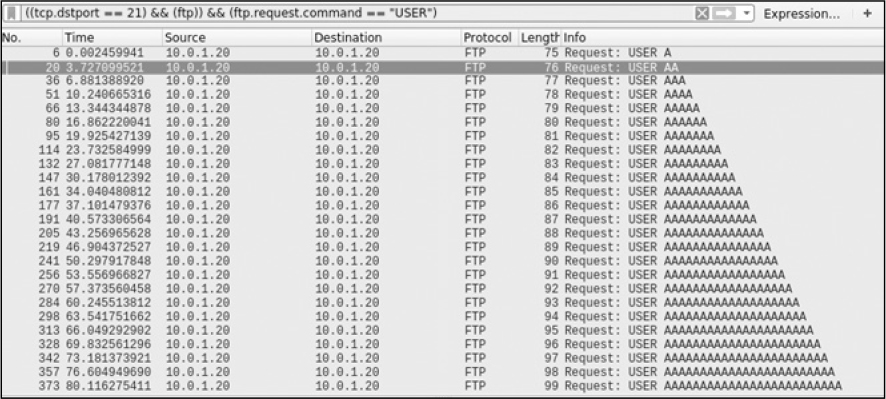

# Writing And Porting Exploit Code
In the majority of the previous chapters, you used Go to create network-based attacks. You’ve 
explored raw TCP, HTTP, DNS, SMB, database interaction, and passive packet capturing.

This chapter focuses instead on identifying and exploiting vulnerabilities. First, you’ll learn how to create a 
vulnerability fuzzer to discover an application’s security weaknesses. Then you’ll learn how to port existing 
exploits to Go. Finally, we’ll show you how to use popular tools to create Go-friendly shellcode. By the end of 
the chapter, you should have a basic understanding of how to use Go to discover flaws while also using it to write 
and deliver various payloads.

### Creating A Fuzzer
[Fuzzing](https://owasp.org/www-community/Fuzzing) is a technique that sends extensive amounts of data to an 
application in an attempt to force the application to produce abnormal behavior. This behavior can reveal coding 
errors or security deficiencies, which you can later exploit.

`Fuzzing an application` can also produce undesirable side effects, such as resource exhaustion, memory corruption, 
and service interruption. Some of these side effects are necessary for bug hunters and exploit developers to do 
their jobs but bad for the stability of the application. Therefore, it’s crucial that you always perform fuzzing in a 
controlled lab environment. As with most of the techniques we discuss in this book, don’t fuzz applications or systems 
without explicit authorization from the owner.

In this section, you’ll build two fuzzers. The first will check the capacity of an input in an attempt to crash a 
service and identify a [buffer overflow](https://owasp.org/www-community/vulnerabilities/Buffer_Overflow). The second 
fuzzer will replay an HTTP request, cycling through potential input values to detect [SQL injection](https://owasp.org/www-community/attacks/SQL_Injection).

Buffer Overflow readings:
  - https://owasp.org/www-community/vulnerabilities/Buffer_Overflow
  - https://owasp.org/www-community/attacks/Buffer_overflow_attack

SQL Injection readings:
  - https://owasp.org/www-community/attacks/SQL_Injection

#### _Buffer Overflow Fuzzing_
Buffer overflows occur when a user submits more data in an input than the application has allocated memory space for. 
For example, a user could submit 5,000 characters when the application expects to receive only 5. If a program uses the 
wrong techniques, this could allow the user to write that surplus data to parts of memory that aren’t intended for that 
purpose. This “overflow” corrupts the data stored within adjacent memory locations, allowing a malicious user to 
potentially crash the program or alter its logical flow.

Buffer overflows are particularly impactful for network-based programs that receive data from clients. Using buffer 
overflows, a client can disrupt server availability or possibly achieve remote code execution.

##### How Buffer Overflow Fuzzing Works
Fuzzing to create a buffer overflow generally involves submitting increasingly longer inputs, such that each subsequent 
request includes an input value whose length is one character longer than the previous attempt. A contrived example 
using the A character as input would execute according to the pattern shown in below diagram.

By sending numerous inputs to a vulnerable function, you’ll eventually reach a point where the length of your input 
exceeds the function’s defined buffer size, which will corrupt the program’s control elements, such as its return and 
instruction pointers. At this point, the application or system will crash.

By sending incrementally larger requests for each attempt, you can precisely determine the expected input size, which 
is important for exploiting the application later. You can then inspect the crash or resulting core dump to better 
understand the vulnerability and attempt to develop a working exploit. We won’t go into debugger usage and exploit 
development here; instead, let’s focus on writing the fuzzer.

You can also read more about Core dump in below links:
  - https://wiki.archlinux.org/index.php/Core_dump
  - https://en.wikipedia.org/wiki/Core_dump

```
Attempt     Input Value
1           A
2           AA
3           AAA
N           A repeated N times
```

If you’ve done any manual fuzzing using modern, interpreted languages, you’ve probably used a construct to create 
strings of specific lengths. For example, the following Python code, run within the interpreter console, shows how 
simple it is to create a string of 25 A characters:
```python
>>> x = "A"*25
>>> x
'AAAAAAAAAAAAAAAAAAAAAAAAA'
```

Unfortunately, Go has no such construct to conveniently build strings of arbitrary length. You’ll have to do that the 
old-fashioned way—using a loop—which would look something like this:
```go
var (
        n int
        s string
)
for n = 0; n < 25; n++ {
    s += "A"
}
```

Sure, it’s a little more verbose than the Python alternative, but not overwhelming.

The other consideration you’ll need to make is the delivery mechanism for your payload. This will depend on the target 
application or system. In some instances, this could involve writing a file to a disk. In other cases, you might 
communicate over TCP/UDP with an HTTP, SMTP, SNMP, FTP, Telnet, or other networked service.

In the following example, you’ll perform fuzzing against a `remote FTP server`. You can tweak a lot of the logic we 
present fairly quickly to operate against other protocols, so it should act as a good basis for you to develop custom 
fuzzers against other services.

Although Go’s standard packages include support for some common protocols, such as HTTP and SMTP, they don’t include 
support for client-server FTP interactions. Instead, you could use a third-party package that already performs FTP 
communications, so you don’t have to reinvent the wheel and write something from the ground up. However, for maximum 
control (and to appreciate the protocol), you’ll instead build the basic FTP functionality using raw TCP communications. 
If you need a refresher on how this works, refer to [Chapter 2](../ch2).

##### Building The Buffer Overflow Fuzzer
[ftp-fuzz/main.go](ftp-fuzz/main.go) shows the fuzzer code. We’ve hardcoded some values, such as the target IP and 
port, as well as the maximum length of your input. The code itself fuzzes the `USER` property. Since this property 
occurs before a user is authenticated, it represents a commonly testable point on the attack surface. You could 
certainly extend this code to test other pre-authentication commands, such as `PASS`, but keep in mind that if you 
supply a legitimate username and then keep submitting inputs for PASS, you might get locked out eventually.
```go
func main() {
  ❶ for i := 0; i < 2500; i++ {
      ❷ conn, err := net.Dial("tcp", "test.rebex.net:22")
         if err != nil {
          ❸ log.Fata lf("[!] Error at offset %d: %s\n", i, err)
         }  
      ❹ bufio.NewReader(conn).ReadString('\n')

         user := ""
      ❺ for n := 0; n <= i; n++ {
             user += "A"
          }  

         raw := "USER %s\n"
      ❻ fmt.Fprintf(conn, raw, user)
         bufio.NewReader(conn).ReadString('\n')

         raw = "PASS password\n"
         fmt.Fprint(conn, raw)
         bufio.NewReader(conn).ReadString('\n')

         if err := conn.Close()❼; err != nil {
          ❽ log.Println("[!] Error at offset %d: %s\n", i, err)
         }  
    }  
}
```
The code is essentially one large loop, beginning at ❶. Each time the program loops, it adds another character to the 
username you’ll supply. In this case, you’ll send usernames from 1 to 2,500 characters in length.

For each iteration of the loop, you establish a TCP connection to the destination FTP server ❷. Any time you interact 
with the FTP service, whether it’s the initial connection or the subsequent commands, you explicitly read the response 
from the server as a single line ❹. This allows the code to block while waiting for the TCP responses so you don’t 
send your commands prematurely, before packets have made their round trip. You then use another for loop to build the 
string of As in the manner we showed previously ❺. You use the index i of the outer loop to build the string length 
dependent on the current iteration of the loop, so that it increases by one each time the program starts over. You use 
this value to write the USER command by using fmt.Fprintf(conn, raw, user) ❻.

Although you could end your interaction with the FTP server at this point (after all, you’re fuzzing only the USER 
command), you proceed to send the PASS command to complete the transaction. Lastly, you close your connection cleanly ❼.

It’s worth noting that there are two points, ❸ and ❽, where abnormal connectivity behavior could indicate a service 
disruption, implying a potential buffer overflow: when the connection is first established and when the connection 
closes. If you can’t establish a connection the next time the program loops, it’s likely that something went wrong. 
You’ll then want to check whether the service crashed as a result of a buffer overflow.

If you can’t close a connection after you’ve established it, this may indicate the abnormal behavior of the remote 
FTP service abruptly disconnecting, but it probably isn’t caused by a buffer overflow. The anomalous condition is 
logged, but the program will continue.

A packet capture, illustrated in below picture, shows that each subsequent USER command grows in length, confirming that 
your code works as desired.


You could improve the code in several ways for flexibility and convenience. For example, you’d probably want to remove 
the hardcoded IP, port, and iteration values, and instead include them via command line arguments or a configuration 
file. We invite you to perform these usability updates as an exercise. Furthermore, you could extend the code so it 
fuzzes commands after authentication. Specifically, you could update the tool to fuzz the CWD/CD command. Various tools 
have historically been susceptible to buffer overflows related to the handling of this command, making it a good target 
for fuzzing.

#### _SQL Injection Fuzzing_
In this section, you’ll explore SQL injection fuzzing. Instead of changing the length of each input, this variation on 
the attack cycles through a defined list of inputs to attempt to cause SQL injection. In other words, you’ll fuzz the 
username parameter of a website login form by attempting a list of inputs consisting of various SQL meta-characters and 
syntax that, if handled insecurely by the backend database, will yield abnormal behavior by the application.

To keep things simple, you’ll be probing only for error-based SQL injection, ignoring other forms, such as boolean-, 
time-, and union-based. That means that instead of looking for subtle differences in response content or response time, 
you’ll look for an error message in the HTTP response to indicate a SQL injection. This implies that you expect the 
web server to remain operational, so you can no longer rely on connection establishment as a litmus test for whether 
you’ve succeeded in creating abnormal behavior. Instead, you’ll need to search the response body for a database error 
message.

##### How SQL Injection WOrks
At its core, SQL injection allows an attacker to insert SQL meta-characters into a statement, potentially manipulating 
the query to produce unintended behavior or return restricted, sensitive data. The problem occurs when developers 
blindly concatenate untrusted user data to their SQL queries, as in the following pseudocode:
```go
username = HTTP_GET["username"]
query = "SELECT * FROM users WHERE user = '" + username + "'"
result = db.execute(query)
if(len(result) > 0) {
    return AuthenticationSuccess()
} else {
    return AuthenticationFailed()
}
```
In our pseudocode, the username variable is read directly from an HTTP parameter. The value of the username variable 
isn’t sanitized or validated. You then build a query string by using the value, concatenating it onto the SQL query 
syntax directly. The program executes the query against the database and inspects the result. If it finds at least 
one matching record, you’d consider the authentication successful. The code should behave appropriately so long as 
the supplied username consists of alphanumeric and a certain subset of special characters. For example, supplying 
a username of alice results in the following safe query:
```sql
SELECT * FROM users WHERE user = 'alice'
```

However, what happens when the user supplies a username containing an apostrophe? Supplying a username of o'doyle 
produces the following query:
```sql
SELECT * FROM users WHERE user = 'o'doyle'
```

The problem here is that the backend database now sees an unbalanced number of single quotation marks. Notice the 
emphasized portion of the preceding query, doyle; the backend database interprets this as SQL syntax, since it’s 
outside the enclosing quotes. This, of course, is invalid SQL syntax, and the backend database won’t be able to 
process it. For error-based SQL injection, this produces an error message in the HTTP response. The message itself 
will vary based on the database. In the case of MySQL, you’ll receive an error similar to the following, possibly 
with additional details disclosing the query itself:
```shell script
You have an error in your SQL syntax
```

Although we won’t go too deeply into exploitation, you could now manipulate the username input to produce a valid SQL 
query that would bypass the authentication in our example. The username input ' OR 1=1# does just that when placed in 
the following SQL statement:
```sql
SELECT * FROM users WHERE user = '' OR 1=1#'
```

This input appends a logical OR onto the end of the query. This OR statement always evaluates to true, because 1 always 
equals 1. You then use a MySQL comment (#) to force the backend database to ignore the remainder of the query. This 
results in a valid SQL statement that, assuming one or more rows exist in the database, you can use to bypass authentication 
in the preceding pseudocode example.

##### Building the SQL Injection Fuzzer
The intent of your fuzzer won’t be to generate a syntactically valid SQL statement. Quite the opposite. 
You’ll want to break the query such that the malformed syntax yields an error by the backend database, 
as the O’Doyle example just demonstrated. For this, you’ll send various SQL meta-characters as input.

The first order of business is to analyze the target request. By inspecting the HTML source code, using 
an intercepting proxy, or capturing network packets with Wireshark, you determine that the HTTP request 
submitted for the login portal resembles the following:
```shell
POST /WebApplication/login.jsp HTTP/1.1
Host: 10.0.1.20:8080
User-Agent: Mozilla/5.0 (X11; Ubuntu; Linux x86_64; rv:54.0) Gecko/20100101 Firefox/54.0
Accept: text/html,application/xhtml+xml,application/xml;q=0.9,*/*;q=0.8
Accept-Language: en-US,en;q=0.5
Accept-Encoding: gzip, deflate
Content-Type: application/x-www-form-urlencoded
Content-Length: 35
Referer: http://10.0.1.20:8080/WebApplication/
Cookie: JSESSIONID=2D55A87C06A11AAE732A601FCB9DE571
Connection: keep-alive
Upgrade-Insecure-Requests: 1

username=someuser&password=somepass
```

The login form sends a POST request to `http://10.0.1.20:8080/WebApplication/login.jsp`. There are two 
form parameters: `username` and `password`. For this example, we’ll limit the fuzzing to the username 
field for brevity. The code itself is fairly compact, consisting of a few loops, some regular expressions, 
and the creation of an HTTP request. It’s shown in [http-fuzz/main.go](http-fuzz/main.go):
```go
func main() {
 ❶ payloads := []string{
        "baseline",
        ")",
        "(",
        "\"",
        "'",
    }  

 ❷ sqlErrors := []string{
        "SQL",
        "MySQL",
        "ORA-",
        "syntax",
    }  

    errRegexes := []*regexp.Regexp{}
    for _, e := range sqlErrors {
     ❸ re := regexp.MustCompile(fmt.Sprintf(".*%s.*", e))
        errRegexes = append(errRegexes, re)
    }  

 ❹ for _, payload := range payloads {
        client := new(http.Client)
    ❺ body := []byte(fmt.Sprintf("username=%s&password=p", payload))
    ❻ req, err := http.NewRequest(
           "POST",
           "http://10.0.1.20:8080/WebApplication/login.jsp",
           bytes.NewReader(body),
        )  
        if err != nil {
            log.Fatalf("[!] Unable to generate request: %s\n", err)
        }  
        req.Header.Add("Content-Type", "application/x-www-form-urlencoded")
        resp, err := client.Do(req)
        if err != nil {
            log.Fatalf("[!] Unable to process response: %s\n", err)
        }  
     ❼ body, err = ioutil.ReadAll(resp.Body)
        if err != nil {
            log.Fatalf("[!] Unable to read response body: %s\n", err)
        }  
        resp.Body.Close()

     ❽ for idx, re := range errRegexes {
         ❾ if re.MatchString(string(body)) {
                fmt.Printf(
                    "[+] SQL Error found ('%s') for payload: %s\n",
                    sqlErrors[idx],
                    payload,
                )
                break
            }  
        }  
    }  
}
```

The code begins by defining a slice of payloads you want to attempt ❶. This is your fuzzing list that 
you’ll supply later as the value of the username request parameter. In the same vein, you define a slice 
of strings that represent keywords within an SQL error message ❷. These will be the values you’ll search 
for in the HTTP response body. The presence of any of these values is a strong indicator that an SQL 
error message is present. You could expand on both of these lists, but they’re adequate datasets for 
this example.

Next, you perform some preprocessing work. For each of the error keywords you wish to search for, you 
build and compile a regular expression ❸. You do this work outside your main HTTP logic so you don’t 
have to create and compile these regular expressions multiple times, once for each payload. A minor 
optimization, no doubt, but good practice nonetheless. You’ll use these compiled regular expressions 
to populate a separate slice for use later.

Next comes the core logic of the fuzzer. You loop through each of the payloads ❹, using each to build 
an appropriate HTTP request body whose username value is your current payload ❺. You use the resulting 
value to build an HTTP POST request ❻, targeting your login form. You then set the Content-Type header 
and send the request by calling client.Do(req).

Notice that you send the request by using the long-form process of creating a client and an individual 
request and then calling `client.Do()`. You certainly could have used Go’s `http.PostForm()` function 
to achieve the same behavior more concisely. However, the more verbose technique gives you more granular 
control over HTTP header values. Although in this example you’re setting only the Content-Type header, 
it’s not uncommon to set additional header values when making HTTP requests (such as User-Agent, Cookie, 
and others). You can’t do this with http.PostForm(), so going the long route will make it easier to add any 
necessary HTTP headers in the future, particularly if you’re ever interested in fuzzing the headers themselves.

Next, you read the HTTP response body by using ioutil.ReadAll() ❼. Now that you have the body, you loop 
through all of your precompiled regular expressions ❽, testing the response body for the presence of 
your SQL error keywords ❾. If you get a match, you probably have a SQL injection error message. The program will 
log details of the payload and error to the screen and move onto the next iteration of the loop.

Run your code to confirm that it successfully identifies a SQL injection flaw in a vulnerable login form. 
If you supply the username value with a single quotation mark, you’ll get the error indicator SQL, as shown here:
```shell
$ go run main.go
[+] SQL Error found ('SQL') for payload: '
```

> Please refer [here](https://www.acunetix.com/websitesecurity/sql-injection2/#:~:text=Time%2Dbased%20SQL%20Injection%20is,query%20is%20TRUE%20or%20FALSE.) for 
> different types of SQL Injection

We encourage you to try the following exercises to help you better understand the code, appreciate the nuances 
of HTTP communications, and improve your ability to detect SQL injection:
  - Update the code to test for time-based SQL injection. To do this, you’ll have to send various payloads 
    that introduce a time delay when the backend query executes. You’ll need to measure the round-trip 
    time and compare it against a baseline request to deduce whether SQL injection is present.
  - Update the code to test for boolean-based blind SQL injection. Although you can use different indicators 
    for this, a simple way is to compare the HTTP response code against a baseline response. A deviation 
    from the baseline response code, particularly receiving a response code of 500 (internal server error), 
    may be indicative of SQL injection.
  - Rather than relying on Go’s net.http package to facilitate communications, try using the net package to 
    dial a raw TCP connection. When using the net package, you’ll need to be aware of the Content-Length 
    HTTP header, which represents the length of the message body. You’ll need to calculate this length correctly 
    for each request because the body length may change. If you use an invalid length value, the server will 
    likely reject the request.

In the next section, we’ll show you how to port exploits to Go from other languages, such as Python or C.


### Porting Exploits To Go